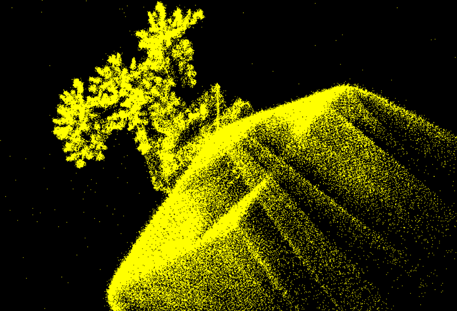
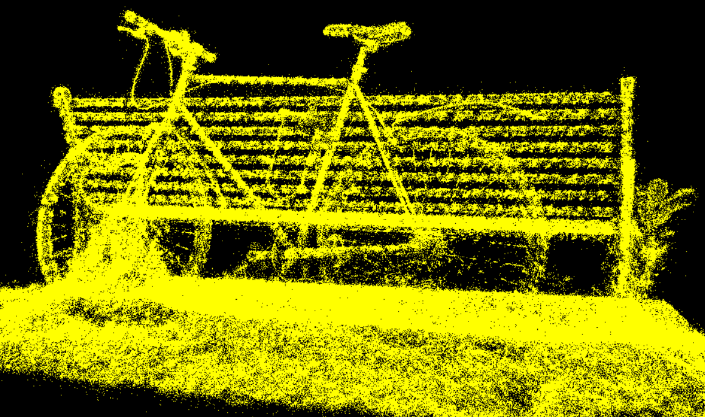

# Project5-WebGPU-Gaussian-Splat-Viewer

**University of Pennsylvania, CIS 5650: GPU Programming and Architecture, Project 4**

**Author:** Lu Men ([LinkedIn](https://www.linkedin.com/in/lu-m-673425323/))

**Tested System:**
 - Windows 11 Home
 - AMD Ryzen 7 5800HS @ 3.20GHz, 16GB RAM
 - NVIDIA GeForce RTX 3060 Laptop GPU 6GB (Compute Capability 8.6)
 - Brave 1.83.118 (Official Build) (64-bit), Chromium: 141.0.7390.108

## Abstract

Gaussian splatting is a point-based rendering technique where each 3D point is rasterized as a screen-space Gaussian (an oriented, elliptical splat) instead of a single pixel or a simple point primitive. Each splat carries a position, covariance (or size/orientation), and color. When splats overlap, their contributions are composited (typically with alpha blending or more advanced density-to-color compositing) to reconstruct a smooth, continuous appearance with explicit control over per-point extent and anisotropy.

## Methods (implementation details)

This implementation follows three main stages: preprocess, sort, and render. Each stage is designed to be GPU-friendly and to leverage WebGPU compute pipelines where possible.

### Preprocess

- Input: a point-cloud (positions, normals, color, optional radius/covariance) loaded from a PLY or custom format.
- Transform points into view space on the GPU: positions are multiplied by view and projection matrices to compute clip-space and screen-space coordinates.
- Compute per-point splat parameters: screen-space position, size/radius (derived from a per-point radius or from depth and an object-space radius), and a 2x2 covariance (or approximated ellipse) that encodes anisotropy/orientation in screen space. If normals are available, they can be used to orient anisotropic splats.
- Pack parameters into compact GPU-friendly buffers (structured arrays) for later compute and raster stages.

### Sort

- Purpose: sorting points back-to-front is required for correct alpha blending when using standard blending. Additionally, sorting can improve memory coherence during rasterization.
- Implementation: a GPU radix sort (fully on-GPU compute shader) sorts points by depth (or by a depth tile key) using a parallel prefix-sum and counting passes. The repo includes a WebGPU-compatible radix sort compute shader and the TypeScript wiring to run it.
- Output: an index buffer or reordered point buffer arranged in decreasing depth order.

### Render

- Two renderers are provided:
  - Point-cloud renderer: renders raw points with a simple size and per-point color. This uses a minimal vertex/fragment pipeline.
  - Gaussian splat renderer: for each splat, a screen-space quad (or instanced billboard) is rasterized and shaded with a precomputed Gaussian weight (implemented in WGSL) using the splat covariance and color. The fragment shader evaluates the Gaussian value per-pixel and composites it into the framebuffer with additive or alpha blending.

## Visual comparison

### Bonsai (272,965 points)

<table>
  <tr>
    <th>Point Cloud Renderer</th>
    <th>Gaussian Splatting</th>
  </tr>
  <tr>
    <td></td>
    <td></td>
  </tr>
  <tr>
    <td style="text-align:center">272,965 points — point renderer</td>
    <td style="text-align:center">272,965 points — gaussian splatting</td>
  </tr>
</table>

Observation: for the bonsai dataset (272,965 points) both renderers saturate the display refresh on the test laptop and hit the monitor's 144 Hz cap in the author's measurements.

### Bicycle (1,063,091 points)

<table>
  <tr>
    <th>Point Cloud Renderer</th>
    <th>Gaussian Splatting</th>
  </tr>
  <tr>
    <td></td>
    <td></td>
  </tr>
  <tr>
    <td style="text-align:center">1,063,091 points — point renderer</td>
    <td style="text-align:center">1,063,091 points — gaussian splatting</td>
  </tr>
</table>

Measured performance (personal laptop):

- Bonsai (272,965 points): both renderers hit the display cap at 144 Hz.
- Bicycle (1,063,091 points): point-cloud renderer ≈ 100 Hz; Gaussian splatting renderer ≈ 44 Hz.

Brief explanation: the Gaussian splatting renderer rasterizes a screen-space quad per point and evaluates a Gaussian per-fragment. For dense clouds (the bicycle set) this produces significantly more fragment shader work and overdraw compared to rendering simple points (which either produce fewer fragments or are rasterized with a cheaper shader). Sorting adds overhead but is usually minor compared to the fragment cost at high splat coverage. For the bonsai dataset the total fragment workload is low enough that both renderers are bottlenecked by other factors (presentation, CPU-GPU sync, or the display's refresh rate), hence both appear similarly fast.

Note: these are preliminary numbers from a single machine. More comprehensive benchmarking is required (different GPUs, tile-based profiling, memory bandwidth counters, and varying splat sizes) to draw robust conclusions.

## Build instructions

Prereq: [Node.js](https://nodejs.org/en/download)

1) Clone repository

```cmd
git clone https://github.com/lu-m-dev/WebGPU-Gaussian-Splatting.git
```

2) Install dependencies
```cmd
cd WebGPU-Gaussian-Splatting
npm install
```

3) Launch the dev server (opens your browser)

```cmd
npm run dev
```

Optional build to static `dist/`:

```cmd
npm run build
```

### Credits

- [Vite](https://vitejs.dev/)
- [tweakpane](https://tweakpane.github.io/docs//v3/monitor-bindings/)
- [stats.js](https://github.com/mrdoob/stats.js)
- [wgpu-matrix](https://github.com/greggman/wgpu-matrix)
- Special Thanks to: Shrek Shao (Google WebGPU team) & [Differential Guassian Renderer](https://github.com/graphdeco-inria/diff-gaussian-rasterization)
